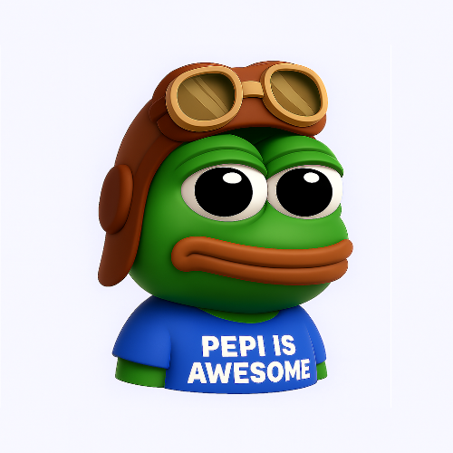

<p align="center">
  
</p>

# Pepi ai
Pepi is a universal AI task orchestrator using LangChain and Ollama. It can collect data, make decisions, request user confirmation, and execute actions dynamically and all based on the user prompt.

## Main goal
The main goal in this project is creating a virtual assistant, that can handle and execute all the easy but long time tasks without using device's screen or something. The task/prompt can include one or many tasks.

## How it works
Pepi has 4 phases and each prompt goes inside of them:
1. **Collecting phase**: Pepi collects all needed data using the tools we gave him and stores them in context.
2. **Deciding phase**: Pepi reads the context, process it and decides what to do with user prompt and this data.
3. **User cnonfirmation phase**: Pepi sends the decision to user to get confirmation to do the next steps.
4. **Execution phase**: Pepi executes the needed steps with tools to finish the task.

## Installation
Clone the repository and run:

```bash
npm install
```

then, 
```bash
node src/index.js
```

This will run the example case that has simulation tools for the given task (user prompt).

## Next steps
For now, Pepi is limited with simulation tools and doesn't execute real tasks.

For next steps, I will
 - [ ] add new tools (Sending/ getting messages, Google Calendar management, GitHub and etc.)
 - [ ] add multitasking (multi-prompting)


## Contact
You can [mail](mailto:ehziyev@gmail.com) me,
see my project updates on [X](https://x.com/ehcdev) or contact with me on [Linkedin](https://www.linkedin.com/in/eminhazi/)

